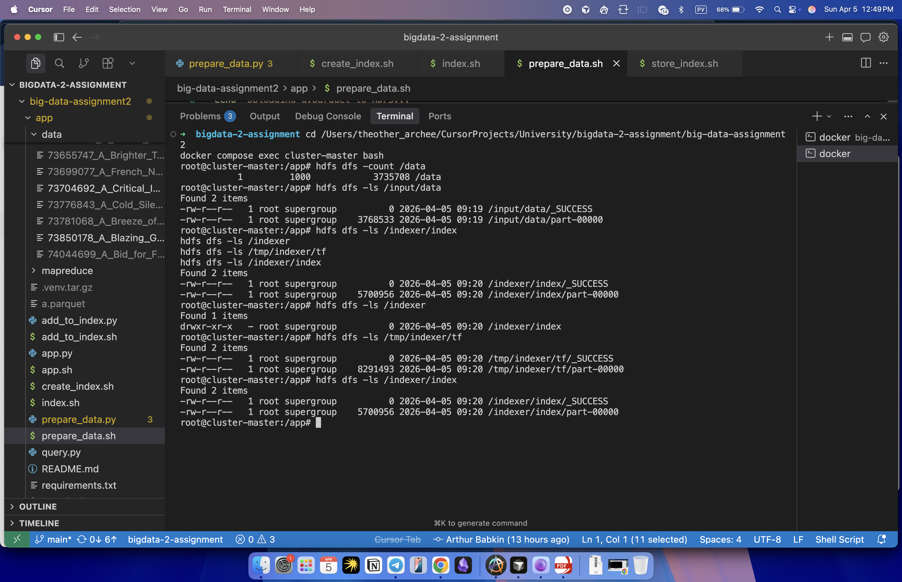
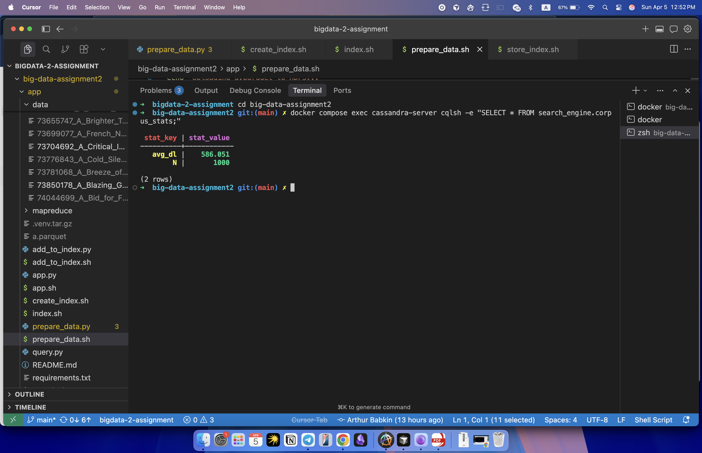
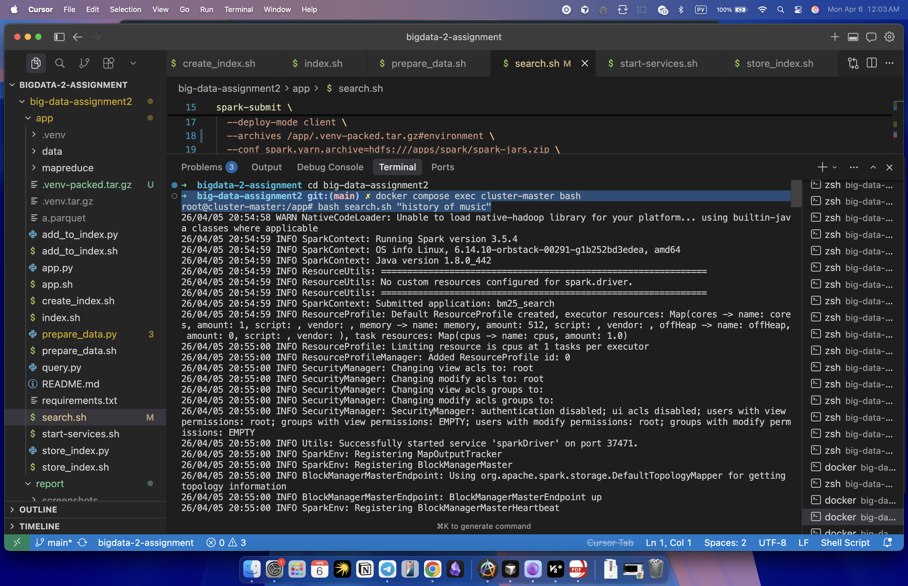
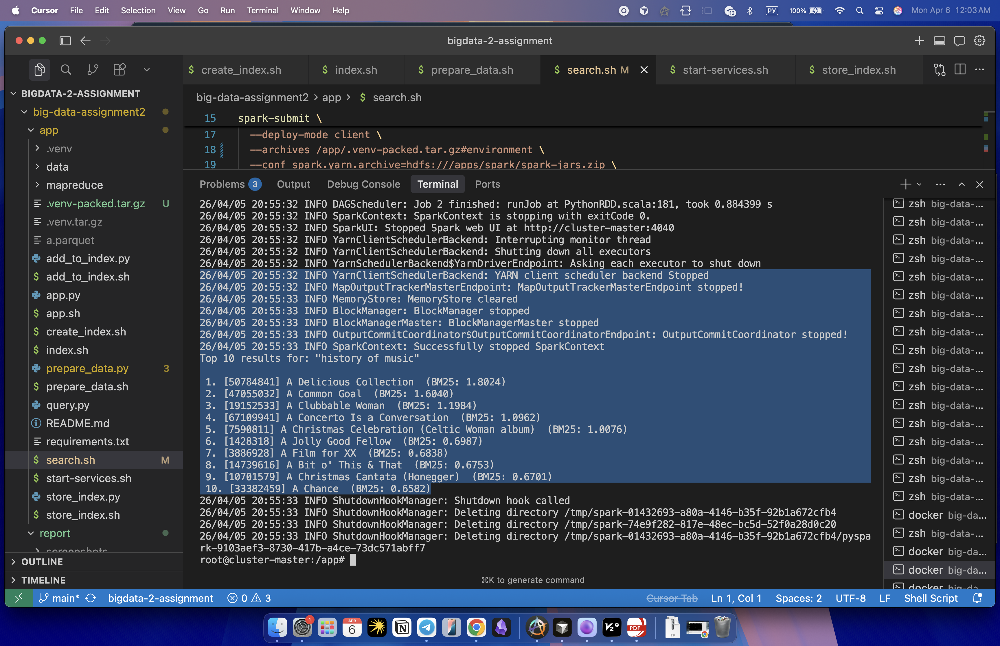
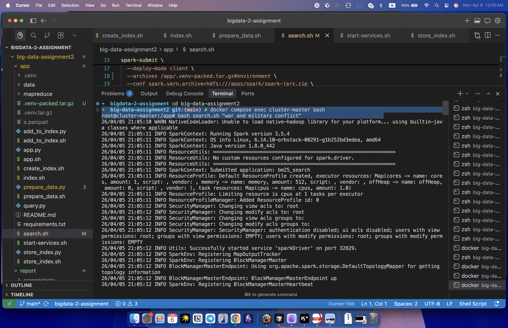
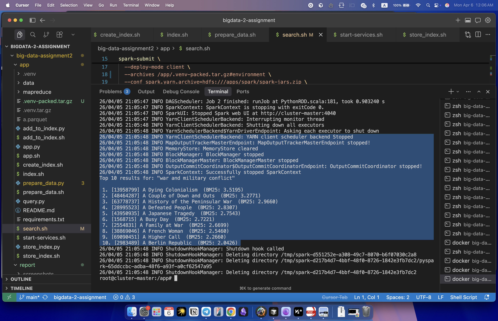
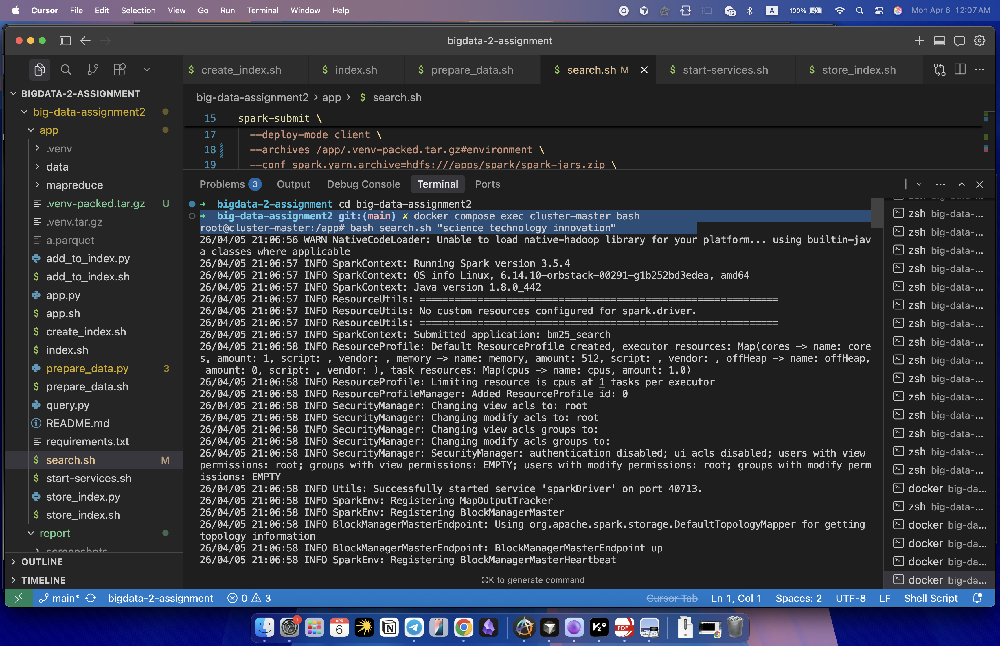
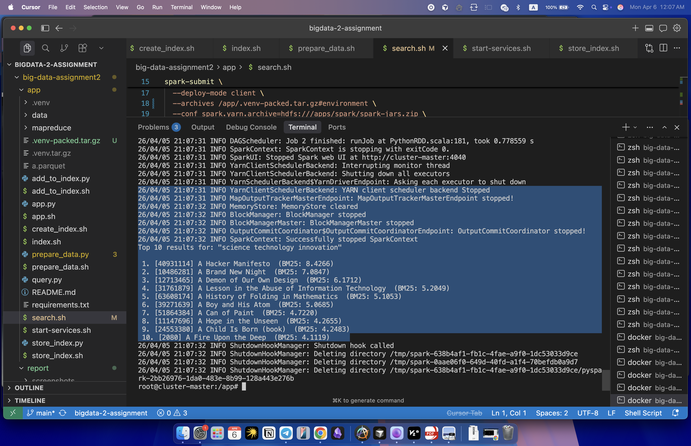

# Assignment 2: Simple Search Engine using Hadoop MapReduce

**Course:** Big Data  
**Author:** Arthur Babkin  
**Repository:** [https://github.com/ArthurBabkin/big-data-assignment2](https://github.com/ArthurBabkin/big-data-assignment2)  
**Dataset:** [Wikipedia articles — a.parquet (from Kaggle)](https://www.kaggle.com/datasets/jjinho/wikipedia-20230701?select=a.parquet)

---

## 1. Methodology

In this assignment I built a search engine that indexes Wikipedia documents using Hadoop MapReduce, stores the index in Cassandra, and ranks query results with BM25 using PySpark RDD. Everything runs inside Docker and is orchestrated by `app.sh`.

### Data Preparation

In `prepare_data.py` I read `a.parquet` from Kaggle dataset with PySpark and sampled 1000 Wikipedia documents using a fixed seed. For each document I write a plain-text file as `<doc_id>_<title>.txt` into local `data/`. Then `prepare_data.sh` uploads that folder to HDFS at `/data`.

After uploading, a Spark RDD job reads all files from HDFS with `wholeTextFiles`, extracts `doc_id` and title from each filename, and writes a tab-separated file to `/input/data` — one partition. Each line:

```
<doc_id>\t<title>\t<text>
```

This is the input for the MapReduce pipelines.

### Indexing — MapReduce

I used two Hadoop Streaming pipelines to build the inverted index.

**Pipeline 1** (`mapper1.py`, `reducer1.py`) computes term frequency. The mapper tokenizes each document (lowercase, letters only) and emits `word\tdoc_id\t1` for each token. It also emits a `__DOCLEN__` record with the document length. The reducer sums counts per `(word, doc_id)` pair and passes `__DOCLEN__` lines through. Output goes to `/tmp/indexer/tf`.

**Pipeline 2** (`mapper2.py`, `reducer2.py`) builds the inverted index. The mapper skips `__DOCLEN__` lines and emits `word\tdoc_id:tf`. The reducer groups by word, collects all postings, counts DF, and outputs:

```
word\tdf\tdoc_id1:tf1\tdoc_id2:tf2\t...
```

Final index is at `/indexer/index`. I needed two pipelines because DF can only be counted after all TF values are aggregated across the full corpus. The vocabulary file (`/indexer/vocab`) is produced later in `store_index.py` — since the index RDD is already in memory at that point, I just map each line to `word\tdf` and save it as a separate partition with no extra MapReduce job.

### Index Storage — Cassandra

In `store_index.py` I load the HDFS data into Cassandra (`search_engine` keyspace) with PySpark. I created four tables:

| Table | Schema | Purpose |
|---|---|---|
| `vocabulary` | `term TEXT PRIMARY KEY, df INT` | term document frequency |
| `inverted_index` | `term TEXT, doc_id TEXT, tf INT` | postings list |
| `doc_stats` | `doc_id TEXT PRIMARY KEY, title TEXT, length INT` | per-document info |
| `corpus_stats` | `stat_key TEXT PRIMARY KEY, stat_value DOUBLE` | N and avg\_dl |

Cassandra is required by the assignment. Term is used as a primary key in both `vocabulary` and `inverted_index`, which makes postings lookups at query time fast. The connection has retry logic because Cassandra takes a few seconds to start in Docker.

### Query Ranking — BM25

In `query.py` I implemented BM25 with PySpark RDD. Given a query:

1. Tokenize the same way as documents.
2. Read `N` and `avg_dl` from `corpus_stats`.
3. Broadcast `doc_stats` (lengths and titles) to all executors.
4. Use `sc.parallelize(terms)` so each query term is processed as a separate RDD partition — each fetches postings from `inverted_index` and computes partial BM25 using:

$$\text{BM25}(q, d) = \sum_{t \in q} \text{IDF}(t) \cdot \frac{tf \cdot (k_1 + 1)}{tf + k_1 \cdot (1 - b + b \cdot \frac{dl}{avg\_dl})}$$

where $k_1 = 1.0$, $b = 0.75$, and $\text{IDF}(t) = \log\left(\frac{N}{df}\right)$.

5. Sum partial scores per document with `reduceByKey`, sort, take top 10.

The `search.sh` script submits the job to YARN in `client` mode and runs it with a single executor. Getting this to work was actually one of the most frustrating parts of the project. At first, `search.sh` used `spark-submit --master local[*]`, and that worked fine, but it did not satisfy the assignment requirement. As soon as I switched to `--master yarn`, the application often got stuck in `ACCEPTED` or `LOCALIZING` and would not start properly.

I tried several different fixes, including changing executor and driver memory, sending the whole virtual environment with `--archives`, and even trying to install packages on the worker manually. Some of these changes helped a little, but none of them solved the issue consistently.

What finally helped was a suggestion from a classmate who had the same M-series Mac setup and had run into a very similar problem. They told me that packing all Spark jars into a single zip file made YARN startup much more reliable. After that, I looked deeper into the issue and found that the problem was caused by two things at the same time. First, my virtual environment archive was too large, around 400 MB, because it also included `pyspark`, even though Spark was already installed on the cluster and did not need to be packaged again. Second, YARN had to download a very large number of Spark jar files separately every time a job started. On my MacBook with an M1 processor, where the cluster runs through x86 emulation, this made job startup extremely slow and unreliable.

To fix this, I changed the setup so the executor receives only a small packed virtual environment through `--archives /app/.venv-packed.tar.gz#environment`. This archive contains only the Python packages that are actually needed on the worker side, such as `cassandra-driver`, while `pyspark` is intentionally excluded because it is already provided by the cluster. I also set `spark.yarn.archive` to point to a prebuilt `spark-jars.zip` stored in HDFS. This allows YARN to localize one archive instead of downloading hundreds of individual jar files, which made startup much faster and more stable. After these changes, YARN finally started jobs normally.

### Incremental Indexing (bonus)

I also implemented `add_to_index.sh` and `add_to_index.py` for adding a single new document to the existing index without rerunning the full pipeline. The script takes a local file, validates the filename format, uploads it to HDFS `/data/`, and calls `add_to_index.py` with the extracted `doc_id`, title, and text.

In `add_to_index.py` I connect to Cassandra and update all four tables:
- `vocabulary`: for each **unique** term in the document, increment `df` by 1 (or insert with `df=1` if new)
- `inverted_index`: insert new postings
- `doc_stats`: insert the new document's length and title
- `corpus_stats`: increment `N` by 1 and recalculate `avg_dl`

---

## 2. Demonstration

### How to Run

Prerequisites: Docker and Docker Compose.

```bash
git clone https://github.com/ArthurBabkin/big-data-assignment2
cd big-data-assignment2
docker compose up
```

`app.sh` runs automatically inside `cluster-master` and does everything: starts HDFS, YARN, sets up Python venv, packs it with `venv-pack`, prepares data, builds the index, stores it in Cassandra, and runs three sample queries on YARN.

To run a custom query after everything is done:

```bash
docker compose exec cluster-master bash
bash search.sh "your query"
```

### Indexing Results

The screenshots below show successful indexing of 1000 documents.



`hdfs dfs -count /data` shows 1000 files uploaded. The screenshot also shows `/input/data/part-00000` (MapReduce input), `/tmp/indexer/tf/part-00000` (Pipeline 1 output), and `/indexer/index/part-00000` (inverted index).



The `corpus_stats` table has `N = 1000.0` and `avg_dl` — both used at query time for BM25.

### Search Query 1: "history of music"





Top results include *A Concerto Is a Conversation*, *A Christmas Celebration (Celtic Woman album)*, and *A Christmas Cantata (Honegger)*. The scores are relatively low because "history" and "music" appear in many documents, so their IDF values are small. Still, the results are on topic.

### Search Query 2: "war and military conflict"





Results include *A History of the Peninsular War*, *A Family at War*, *A Defeated People*, *A Japanese Tragedy*. Scores are noticeably higher than in query 1 — "military" and "conflict" show up in fewer documents, so they carry more weight in BM25.

### Search Query 3: "science technology innovation"





Highest BM25 scores of all three queries. *A Hacker Manifesto* ranks first, which makes sense — it's a well-known book about technology, digital networks, and information society. *A Lesson in the Abuse of Information Technology* and *A Boy and His Atom* also fit the query well.

### Reflections
This project worked well as a compact end-to-end search engine: documents were prepared in Spark, indexed with Hadoop Streaming, stored in Cassandra, and queried with BM25 in PySpark. The ranking itself behaved as expected — more specific queries produced more convincing results, while broader queries with common words gave weaker scores.

The hardest part was not the ranking logic itself, but getting the whole system to run reliably on YARN. Local mode worked almost immediately, but moving to YARN introduced a lot of setup issues, especially around dependency distribution and job startup. In particular, the cluster was slow to start jobs because too much had to be localized at launch. A useful hint from a classmate with the same M-series Mac setup helped me narrow this down. After shrinking the Python environment and using a prebuilt Spark jar archive in HDFS, the job startup became much more stable and predictable.

At the same time, the limitations of the solution are pretty clear. Tokenization is intentionally very simple: I just lowercase the text and keep sequences of Latin letters with a regex. That means there is no stemming, no lemmatization, and no stopword removal, so common words like “the”, “of”, or “and” remain in the index. The Cassandra schema is also designed more for clarity and correctness than for serious large-scale optimization. Even so, for the scope of this assignment, the implementation still covers the full workflow of a search engine: document preparation, indexing, storage, and ranked retrieval.